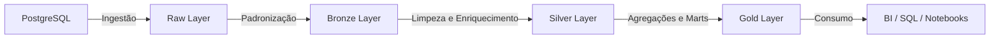

# ⚒️ Data Master — Forja


<p align="center">
  
  
  
  
  
  
</p>

---

## 📑 Sumário
- [🎯 Objetivo do Case](#-objetivo-do-case)  
- [🏗 Arquitetura da Solução](#-arquitetura-da-solução)  
- [⚙️ Arquitetura Técnica](#️-arquitetura-técnica)  
- [🛠 Provisionamento (Terraform)](#-provisionamento-terraform)  
- [📡 Orquestração e Monitoramento (Airflow)](#-orquestração-e-monitoramento-airflow)  
- [🧪 Transformações (Databricks)](#-transformações-databricks)  
- [🔐 Governança e Segurança (Unity Catalog)](#-governança-e-segurança-unity-catalog)  
- [💰 Operação & Custos](#-operação--custos)  
- [🛠 Troubleshooting](#-troubleshooting)  
- [✅ Critérios de Pronto (DoD)](#-critérios-de-pronto-dod)  
- [🚀 Melhorias Futuras](#-melhorias-futuras)  

---

## 🎯 Objetivo do Case

> Assim como uma **forja** transforma metal bruto em artefatos valiosos, este projeto transforma **dados brutos** em **ativos analíticos confiáveis e governados**, seguindo a arquitetura **Medallion** e boas práticas de **DataOps**.  

---

## 🚀 Início Rápido
Para executar localmente (provisionamento + orquestração):  

```bash
./main/init.sh
```
> 🛠 O script provisiona a infraestrutura com **Terraform** e inicia o **Airflow** via **Docker/Astronomer**.  

---

## 🏗 Arquitetura da Solução

### Visão Geral
- **Armazenamento** → Azure Data Lake (ADLS Gen2)  
- **Processamento** → Azure Databricks (Spark + Delta Lake)  
- **Governança** → Unity Catalog (metastore, lineage, RBAC)  
- **Orquestração** → Apache Airflow (Astronomer)  
- **Infra como Código** → Terraform  

### Fluxo de Dados


---

## ⚙️ Arquitetura Técnica

| Componente | Função |
|------------|--------|
| **Resource Group** | Agrupamento lógico dos recursos Azure |
| **Storage Account** | ADLS Gen2 com camadas Raw/Bronze/Silver/Gold |
| **SPN + Key Vault** | Identidade e segredo para acesso seguro |
| **Databricks Workspace** | Processamento e transformação |
| **Unity Catalog** | Governança e segurança de dados |
| **Airflow (Astronomer)** | Orquestração e monitoramento |

---

## 🛠 Provisionamento (Terraform)

**Ordem recomendada**:  
1️⃣ RG → 2️⃣ Storage + Containers → 3️⃣ Key Vault → 4️⃣ SPN → 5️⃣ Role Assignments → 6️⃣ Databricks → 7️⃣ Unity Catalog → 8️⃣ Clusters e Jobs  

**Principais Providers**:  
- `azurerm`  
- `azuread`  
- `databricks`  

---

## 📡 Orquestração (Airflow)

- **DAG Principal**: `extract → bronze → silver → gold`  
- **Operadores**: PythonOperator, DatabricksSubmitRunOperator  
- **Boas Práticas**: retries, logs centralizados, parametrização dinâmica  

---

## 🧪 Transformações (Databricks)

| Camada | Ações |
|--------|-------|
| Bronze | Correção de tipos, persistência Delta |
| Silver | Deduplicação, enriquecimento, joins |
| Gold | Agregações, modelagem (dim/fact), otimização |

---

## 🔐 Governança (Unity Catalog)

- **Storage Credential** → SPN ou identidade gerenciada  
- **External Locations** → raw/bronze/silver/gold  
- **RBAC** → grants por camada e grupo  
- **Lineage** → rastreabilidade completa  

---

## 💰 Custos

- Autotermination clusters: **10–15 min**  
- VM types econômicos (Standard_F4, DS3_v2)  
- Alertas de quota no Azure  

---

## 🛠 Troubleshooting

| Erro | Solução |
|------|---------|
| `INSUFFICIENT_PERMISSIONS` | Revisar grants no UC e roles no Storage |
| `MANAGE no Storage Credential` | Conceder permissão MANAGE ao aplicador |
| `Quota/VM indisponível` | Alterar `node_type_id` ou solicitar aumento |

---

## ✅ Critérios de Pronto (DoD)

✔ Infra provisionada sem drift  
✔ UC configurado (credential, locations, grants)  
✔ DAG executa ingestão + transformação  
✔ Tabelas Delta acessíveis com segurança  
✔ Custos sob controle  

---

## 🚀 Melhorias Futuras

- Airflow em **Kubernetes** com autoscaling (KEDA)  
- Ingestão **real-time** (Kafka/Event Hubs)  
- CI/CD com GitHub Actions  
- Observabilidade e Data Quality (Great Expectations)  

---
