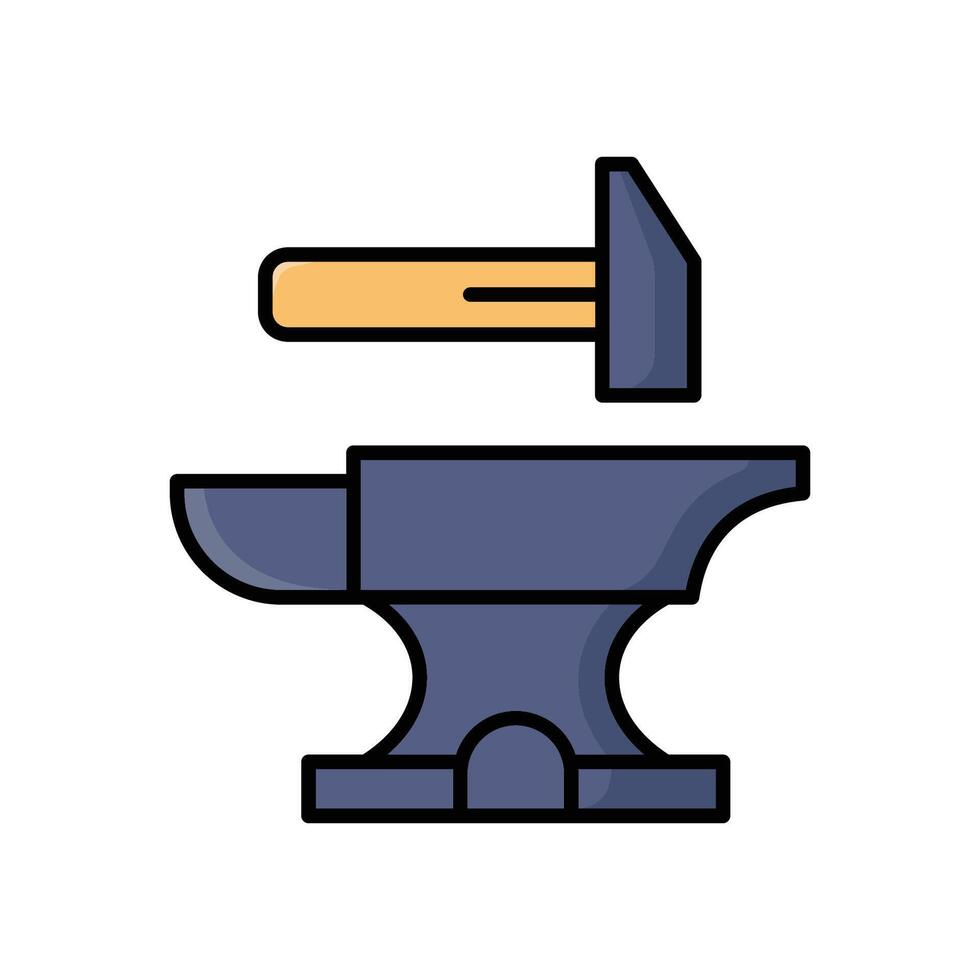
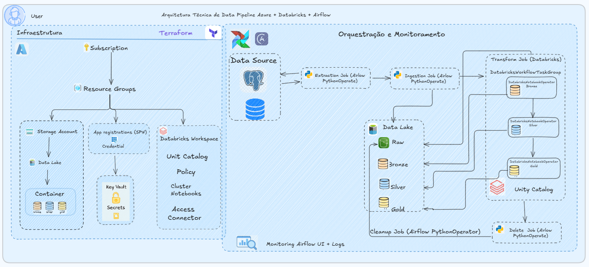
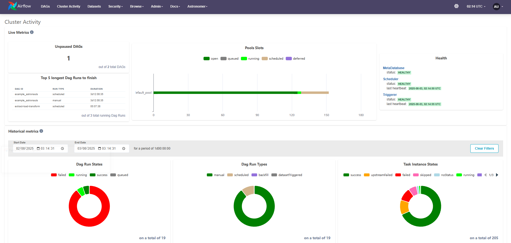
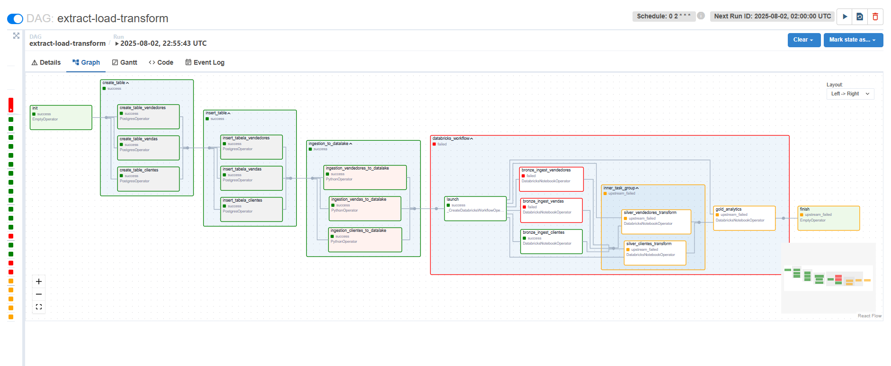
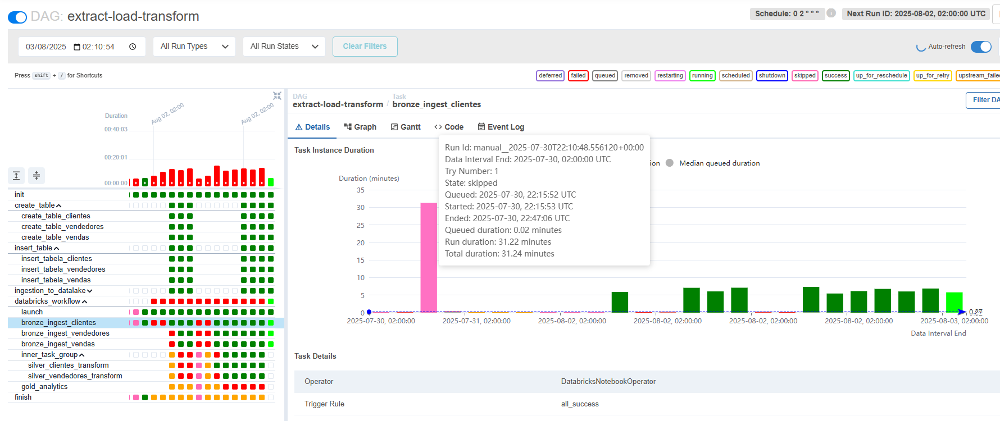
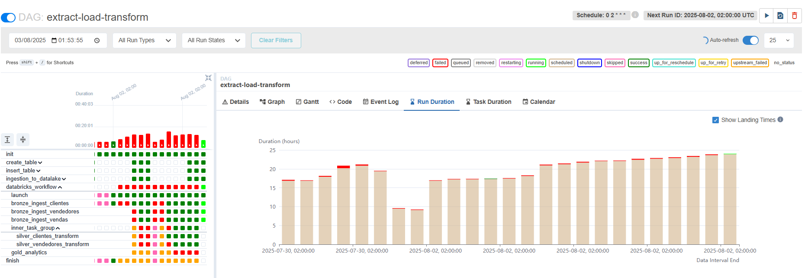
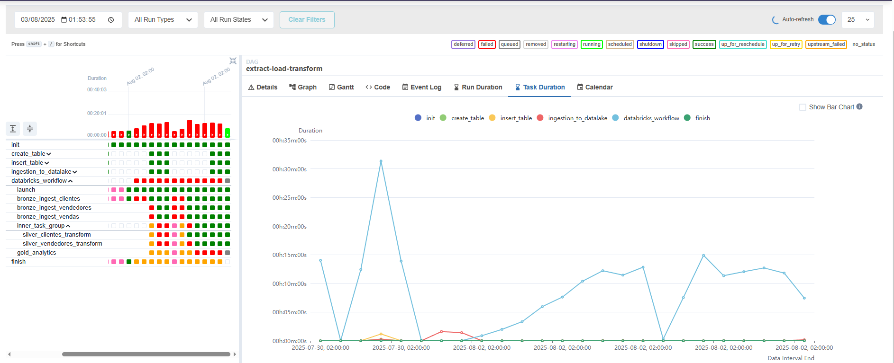
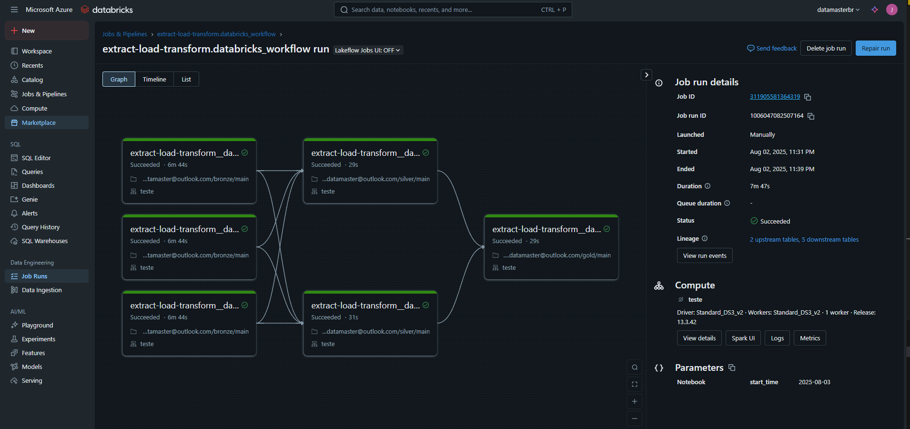

<h1 align="center">Forja — Data Master</h1>

<p align="center">
  
</p>

<p align="center">
  O repositório <strong>forja-datamaster</strong> é uma solução desenvolvida para o programa <strong>Data Master</strong>, organizado pela <strong>F1rst Santander</strong>.  
  <br>
  Solução proposta e desenvolvida por 
  <a href="https://www.linkedin.com/in/jos%C3%A9-duque-29a944100/" target="_blank">José Duque</a>.
</p>

<p align="center">
  <a href="#"></a>
  <a href="#"></a>
  <a href="#"></a>
  <a href="#"></a>
  <a href="#"></a>
  <a href="#"></a>
</p>

---

## Sumário

1. [Objetivo do Case](#objetivo-do-case)

   * [Início Rápido](#início-rápido)
2. [Arquitetura da Solução](#arquitetura-da-solução)

   * [Visão Geral](#visão-geral)
   * [Fluxo de Dados](#fluxo-de-dados)
   * [Tecnologias Utilizadas](#tecnologias-utilizadas)
3. [Arquitetura Técnica](#arquitetura-técnica)

   * [Infraestrutura Provisionada](#infraestrutura-provisionada)
   * [Criação e Inserção de Dados](#criação-e-inserção-de-dados)
   * [Processamento](#processamento)
   * [Provisionamento (Terraform)](#provisionamento-terraform)
4. [Orquestração e Monitoramento (Airflow)](#orquestração-e-monitoramento-airflow)
5. [Transformações (Databricks)](#transformações-databricks)
6. [Governança e Segurança (Unity Catalog)](#governança-e-segurança-unity-catalog)
7. [Operação & Custos](#operação--custos)
8. [Troubleshooting](#troubleshooting)
9. [Critérios de Pronto (DoD)](#critérios-de-pronto-dod)
10. [Melhorias Futuras](#melhorias-futuras)

---

## Objetivo do Case

Assim como uma **forja** transforma metal bruto em artefatos valiosos, este projeto transforma **dados brutos** em **ativos analíticos** governados e confiáveis. A proposta é implementar uma arquitetura completa de **extração → ingestão → transformação → entrega**, com rastreabilidade e segurança ponta a ponta.

### Início Rápido

**Executar o projeto (provisionamento + orquestração):**

```bash
./main/init.sh
```
[Como executar o projeto](./main/README.md)
> **Obs.**: O script inicializa serviços e dependências automaticamente (Terraform, containers do Astronomer/Airflow etc.).

---

## Arquitetura da Solução

### Visão Geral

A solução utiliza serviços da Azure para provisionar um ambiente completo de ingestão, processamento e disponibilização de dados analíticos com:

<p align="left">
  
</p>

* **Armazenamento** em **Azure Data Lake** estruturado no padrão **Medallion** (Raw → Bronze → Silver → Gold).
* **Processamento** com **Azure Databricks** (Apache Spark + Delta Lake).
* **Governança** com **Unity Catalog** (metastore, permissões e external locations).
* **Orquestração e Monitoramento** com **Apache Airflow** (via **Astronomer**).
* **Provisionamento** e reprodutibilidade via **Terraform**.

### Fluxo de Dados

1. **Ingestão**

   * **Fonte**: PostgreSQL (exemplos com DDL/DML automáticos).
   * **Destino**: Camada **Raw** no Data Lake.
2. **Armazenamento em Camadas**

   * **Bronze**: dados brutos padronizados.
   * **Silver**: dados limpos, *dedup*, enriquecidos.
   * **Gold**: dados prontos para consumo analítico (ex.: *marts*, **Smart Tables** quando aplicável).
3. **Processamento**

   * Notebooks/Jobs do Databricks orquestrados pelo Airflow.
4. **Orquestração**

   * DAGs **(Airflow)** com agendamentos, *retries* e logs centralizados.
5. **Entrega**

   * Tabelas Delta publicadas no **Unity Catalog** para acesso por BI/SQL/Notebooks.
6. **Governança e Segurança**

   * Acesso via Azure AD, segredos no Key Vault, Dados mascarado, lineage e auditoria no UC.

### Tecnologias Utilizadas

| Plataforma/Serviço | Recursos/Componentes |
|--------------------|----------------------|
| **Azure**          | Resource Groups, Storage (ADLS Gen2), Key Vault, Azure AD (SPN) |
| **Databricks**     | Workspace, Jobs/Workflows, Cluster Policies, Unity Catalog |
| **Airflow**        | Astronomer |
| **Banco de Dados** | PostgreSQL |
| **Infraestrutura** | Terraform, Docker |

---

## Arquitetura Técnica

### Infraestrutura Provisionada

* **Resource Group** e **Storage Account** com containers: `raw`, `bronze`, `silver`, `gold`.
* **App Registration (SPN)** com **credenciais no Key Vault**.
* **Databricks Workspace** com **Cluster Policy** **Access Connector**.
* **Unity Catalog**: storage credential, external locations, catálogo/esquemas e **grants**.

### Criação e Inserção de Dados

* **Classe DDL**: cria tabelas no PostgreSQL automaticamente.
* **Classe DML**: insere dados a partir de arquivos **JSON**.
* **Airflow Operator**: orquestra as operações de DDL/DML e a ingestão para o Data Lake.

### Processamento

* **ExtractDbSaveToAzure**: extrai do PostgreSQL e persiste no **Raw**.
* **Pipeline Databricks**: **Raw → Bronze → Silver → Gold**, acionado por DAG no Airflow.

### Provisionamento (Terraform)
* Veja mais detalhes sobre a infraestrutura [aqui](./terraform/README.md)

---

## Orquestração e Monitoramento (Airflow)

* **DAGs** principais:

  * `extract_from_source` (PythonOperator) → grava em `raw/`.
  * `ingest_control` (PythonOperator) → valida partições/headers e aciona Databricks.
  * `bronze`, `silver`, `gold` (DatabricksWorkflowsTaskGroup ou DatabricksSubmitRunOperator).
  * `cleanup` (PythonOperator) → remove temporários/antigos.
* **Boas práticas**: `retries`, `retry_delay`, `max_active_runs`, parametrização por `{{ ds }}`.
* **Conexões**: `DATABRICKS_HOST` + `POSTGRES_CONN` (Secret/Env). Com UC Volumes, preferir identidade gerenciada.
* **Observabilidade**: [**Databricks** - **Airflow UI**] (logs, reexecução), métricas e alertas.
* **Gráficos recomendados**: execuções por status, duração das tarefas, taxa sucesso/erro, *SLA misses*.
  <p align="left">
    
    
    
  </p>
  <p align="left">
    
    
    
  </p>

---

## Transformações (Databricks)

* **Bronze**: leitura bruta, correção de tipos, persistência Delta (`overwriteSchema=true` apenas aqui).
* **Silver**: conformidade de chaves, regras de qualidade e *joins*.
* **Gold**: agregações e modelagem.
* **Naming**: `catalog.schema.tabela` (ex.: `main.bronze.clientes` → `main.gold.fato_vendas`).

---

## Governança e Segurança (Unity Catalog)

* **Storage Credential** com identidade gerenciada ou SPN.
* **External Locations** para `raw/bronze/silver/gold` (`abfss://`).
* **Dados Mascarado** com coluna criptografada.
* **Catálogo/Esquemas**: isolar camadas e aplicar **grants** por grupo/perfil.
* **Lineage/Auditoria**: use o UC para rastreabilidade e logs de acesso.

---

## Execução do Projeto

* Pré-requisitos

- [Azure CLI (`az`)](https://learn.microsoft.com/en-us/cli/azure/install-azure-cli)
- [Terraform](https://developer.hashicorp.com/terraform/install)
- [Docker](https://www.docker.com/products/docker-desktop/)
- [Astronomer CLI (`astro`)](https://docs.astronomer.io/astro/cli/install-cli)
- [Python 3](https://www.python.org/downloads/)
- [Git](https://git-scm.com/)

### Validar e executar DAGs

* **DAG** `extract-load-transform`: PostgreSQL → Raw → Bronze → Silver → Gold.

---

## Operação & Custos

* **Job clusters** com **autotermination** (10–15 min).
* Allowlist de `node_type_id` e tamanhos econômicos.
* Alertas de **quota** (cores/VM) e **falhas**.

---

## Troubleshooting

* **INSUFFICIENT\_PERMISSIONS / SELECT on any file**

  * Verifique grants no **External Location** e roles do SPN no Storage.
  * Garanta leitura via **UC** (tabelas) ou configs OAuth corretas.
* **cannot read/create external location / MANAGE no Storage Credential**

  * O aplicador precisa de `MANAGE` no credential e permissões no catálogo.
* **Quota/VM não disponível**

  * Ajuste `node_type_id` via policy ou solicite aumento de cores/região.
* **Key Vault Secret já existe**

  * Use `terraform import` com **ID versionado** do segredo.

---

## Critérios de Pronto (DoD)

* Infra via Terraform aplicada sem *drift*.
* UC configurado (credential, locations, catalog/schemas, grants).
* DAG executa `extract → ingestion → raw → bronze → silver → gold → cleanup` com logs e *retries*.
* Tabelas Delta acessíveis com permissões corretas.
* Custos sob controle (autotermination e tamanhos aprovados).

---

## Melhorias Futuras

* **Airflow em Kubernetes** (Helm Chart oficial, KubernetesExecutor/CeleryK8s, autoscaling com KEDA, Secrets/Configs no cluster e observabilidade nativa). Indicado para produção multiambiente e maior resiliência.
* **Ingestão em tempo real** com Kafka/Event Hubs (streaming) complementando batch.
* **Testes & CI/CD** com GitHub Actions para IaC e código.
* **Alertas proativos** ampliar os mecanismos de tratamento de falhas e adicionar alertas proativos por e-mail ou Slack via Airflow para melhorar a resposta a incidentes.
* **Data Quality e Observabilidade Avançada** implementar ferramentas de qualidade de dados como Great Expectations e expandir a observabilidade com dashboards customizados.

---

## Considerações Finais

Este projeto representa uma fundação sólida para pipelines de dados modernos com foco em automação, governança e escalabilidade.  
A metáfora da forja foi escolhida para representar o trabalho cuidadoso e estruturado necessário para transformar dados brutos em ativos valiosos para a organização.

Ao seguir boas práticas de engenharia de dados e infraestrutura como código, o time é capaz de acelerar o ciclo de entrega de valor, garantir rastreabilidade e reduzir riscos operacionais.  
A arquitetura proposta é modular, extensível e pronta para evoluir conforme novas demandas de negócio e tecnologia.

---

## Autor

José Duque - Engenheiro de Dados ✨